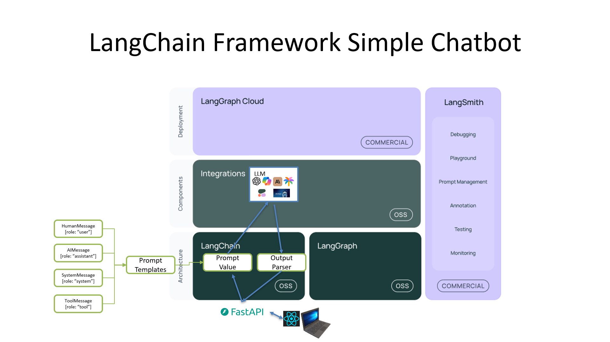

# Lesson 01: Basic Q&A Chatbot

Welcome to Lesson 01 of the **Enterprise-LLM-RAG** course! In this lesson, we'll set up the foundational structure for our application, including both client-side and server-side components.

## **Objectives**

- Understand the project structure.
- Set up the client and server environments.
- Run the initial application.

## **Prerequisites**

- Basic knowledge of Python and JavaScript.
- Git installed on your machine.
- [Any other prerequisites].

## **Getting Started**

### **1. Clone the Repository**

```bash
git clone https://github.com/your-username/Enterprise-LLM-RAG.git
cd Enterprise-LLM-RAG/lessons/01-introduction


